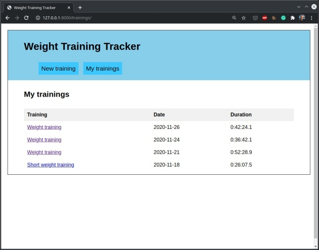
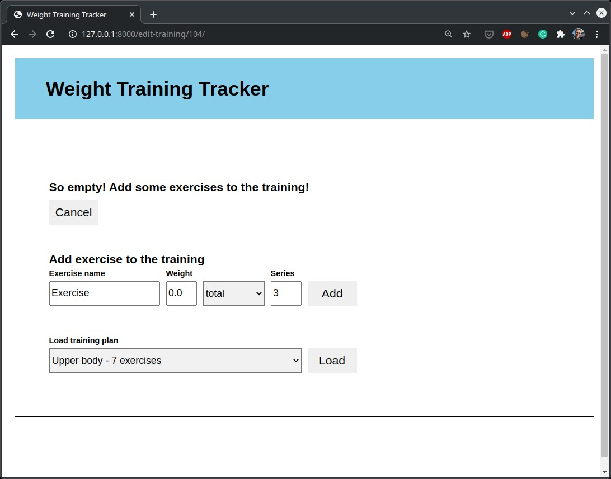
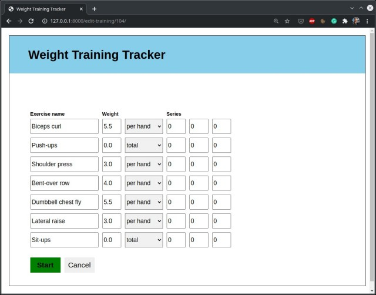
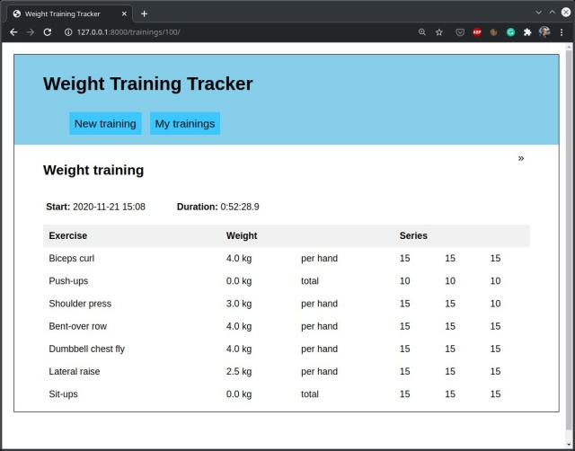

Weight Training Tracker
=======================

Weight Training Tracker is a Django application written in Python 3. It allows you to keep track on your weight training, by recording the time of the training, and number of series and repetitions of each exercise in the training. 

<br />

## Running the app

Clone the repository and change the directory.
```bash
git clone https://github.com/AlbertRtk/weight_training_tracker.git
cd weight_training_tracker
```

Create new virtual environment and install requirements.
```bash
python3 -m venv venv
python3 -m pip install -r requirements.txt
```

Run the server and open http://127.0.0.1:8000/ in your browser.
```bash
python3 manage.py runserver
```

<br />

## Views in the app

### My trainings

Main page. Lists all trainings you have done.



### Start new training

You can add exercises to your training. Pay attention to correctly type the name of exercise and number of series, at the moment it is impossible to edit it later. Weight can be edited during training. 



After you add to your training all exercises you want, it is possible to save the training as a training plan. So, next time you can simply load it and start your workout.



### Training details view

You can check your performance and details of your completed trainings.



<br />

## Future development

* Visualization of training performance progress
